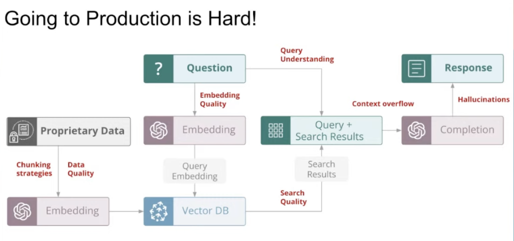

# Haxamoi

## Description

Language learning assistant allowing language learners to track progress and practice conversation at their level. This project leverages a fine-tuned Mistral 7B model and Django for web development, creating an interactive and engaging learning experience.

## In Short

UI to harness mistral LLM for basic conversations.
RAG to remember conversations.

## Features

Must Haves:
- Webapp User Interface: A clean, intuitive interface with a text field for users to input text.
- Once users give their API key they can use the app at will
- Chatbot for Practicing French: Integrates a chatbot for users to practice conversational French, utilizing the Mistral 7B model for natural language understanding and generation.
- Adaptive Learning Algorithm: Develop a backend system capable of adapting the chatbot's responses based on the user's proficiency level, enhancing personalized learning.
- Vocabulary Tracker: Implement counters to track:
  - The number of unique words the user can read.
  - The number of words the user can actively use in conversations.
  - Some sort of linguistic analysis

Nice to haves (maybe implement later)
- User Profile System: Allows users to create accounts, log in, and have their progress and stats remembered across sessions.
- Voice Conversations: Implement voice-to-text and text-to-voice capabilities to allow for more natural practice of listening and speaking skills.
- Hover over words to find out what they mean
- RAG system to remember user conversations

## Technologies Used

Ideas (nothing set in stone)

- Django REST Framework: For building a RESTful API that the frontend can consume, facilitating communication with the Mistral model.
- WebSockets or Django Channels: For real-time chat functionality, ensuring conversations flow seamlessly.
- React or Vue.js: Consider using one of these frameworks for the frontend to create a dynamic and responsive user interface.
- TensorFlow or PyTorch: For any custom machine learning models or additional natural language processing beyond what Mistral provides.
- Docker: For containerizing your application, ensuring it runs consistently across different environments.

- LangChain

## Project Structure - Outline the directory structure of my project

haxamoi/ (project root)
- app/ (Django app for core functionality)
    -  models.py (database models)
    - views.py (business logic and request handling)
    - urls.py (route definitions)
- chatbot/ (chatbot functionality, integrating Mistral)
    - conversation_manager.py (handles conversation logic)
    - language_processing.py (language detection and processing)
- frontend/ (React or Vue.js application)
    - components/ (UI components)
    - services/ (API communication)
- static/ (static files like CSS, JavaScript, and images)
- templates/ (Django templates)
- Dockerfile (for containerization)
- requirements.txt (Python dependencies)
- .env (environment variables for API keys, database URL, etc.)

## Roadmap

Phase 1 - Initial Setup and Basic Features:

Setup Django project and app structure.
Develop the webapp interface and basic chatbot functionality using a simple Mistral 7B integration.
Implement the vocabulary tracker feature.
Phase 2 - Advanced Features and User Management:

Add adaptive learning features to customize the learning experience.
Develop the user profile system for tracking progress over time.
Phase 3 - Voice Conversation and Expansion:

Implement voice-to-text and text-to-voice features for practicing speaking and listening.
Consider expanding the language offerings beyond French, adapting the system to support multiple languages.
Phase 4 - Refinement and Scaling:

Refine the UI/UX based on user feedback.
Optimize the backend for efficiency and scalability to support a growing user base.
Explore additional features such as language games, cultural lessons, and more advanced adaptive learning techniques.

## Resources

CamusBot
https://www.kdnuggets.com/2023/06/build-ai-chatbot-5-minutes-hugging-face-gradio.html

Advance:
Language Progress Tracker: 
  - Use Python to analyze user input and progress over time. Integrate NLP techniques to assess the complexity and variety of language used by the learner, tracking improvements and areas needing attention
  - This would be really fun, like using their own 

LangChain - Tutorial - Intro - Templates

Webdev

## Notes

#### RAG
- LLMs are limited by there knowledge
- Current SOTA is Retrieval Augmented Retrieval
  - Vector data bases (like pinecone)
    - Semantic search (search over unstructured data). Present document and queries as vectors. Get them as close as possible.
  - 10 most relevant documents, concatenate with the query, put in the model and boom!
- Demo is really easy (frameworks like langchain or llama index on canopy), production is hard.

#### RAG Limitations
- Halloucination
- Context overflow problem (token cap)
- Inject and Clean Data, Chunking for embedding modeils, right embedding models, high quality search system.

#### Canopy
- Opensource framework for RAG in production
- Built for Scale using pinecone
- Automatically handles the context overflow issue
- No code - Building from Config
- FastAPI apps and docker image

#### Evaluation RAG is Hard
- Defining eval metrics and making them reliable & comprehensive
- Logging app execution trace to enable granular evals
- Scalably and cost-efficientky eval & monitor apps in production
- Enables fast iteration to improve apps

#### Overview

- Build RAGs with Canopy/Pinecone
- Evaluation with --> TreLens/Truera
https://www.youtube.com/watch?v=fo0F-DAum7E

Slides:
https://docs.google.com/presentation/...

Notebook:
https://github.com/truera/trulens/blo...
